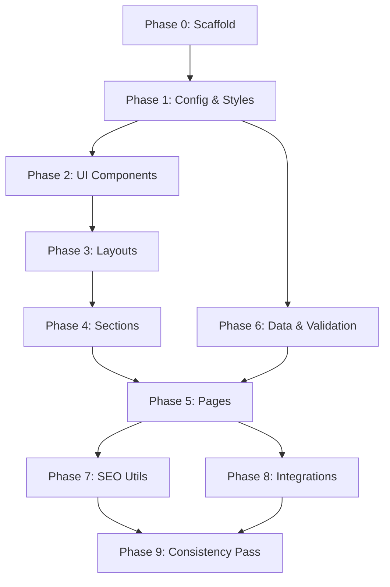

# Document 04: Master Prompt Sequence
**Project:** Complete Care Hospital Website
**Version:** v2.0
**Status:** Approved — Ready for Build

## 1. Overview
This document contains the exact sequence of prompts to be fed into the AI code generation tool (Cursor, GitHub Copilot, Claude, etc.) to build the Complete Care Hospital website. The prompts are ordered by dependency to ensure a logical build progression.

## 2. Global Ground Rules for AI Generation
Paste these rules into the system instructions or custom instructions of your AI assistant before beginning the prompt sequence:

1.  **No placeholder content:** Never use `lorem ipsum` or `[Insert text here]`. Always use the exact business details, doctor names, services, and copy provided in the documentation suite.
2.  **Tech Stack Strictness:** Use strictly Next.js 15 App Router (`/app`), React 19, TypeScript, Tailwind CSS 4, and Framer Motion (`motion/react`). Do not use any other frameworks or libraries unless explicitly requested. Ensure all icons use `lucide-react`.
3.  **Layout Architecture:** All shared page shell elements (Header, Footer, Emergency Banner, Metadata, Fonts) must be implemented within `app/layout.tsx`. Do not duplicate header/footer code in individual page files.
4.  **Accessibility Non-Negotiable:** All interactive elements must have proper ARIA attributes, semantic HTML tags, sufficient color contrast, and keyboard navigability.
5.  **Nigerian Context Lock:** Use Naira (₦) for currency, Nigerian phone number formats (+234), Nigerian time zones (WAT / UTC+1), and local addresses as defined in the project data. Never use USD or generic US locations.
6.  **File Path Discipline:** Follow standard Next.js App Router conventions strictly. Place pages in `app/[route]/page.tsx`, shared components in `components/`, server actions in `lib/actions.ts`, and static assets in `public/`.

---

## 3. The Prompt Sequence

### Phase 0: Project Scaffold
**Prompt 0.1:**
> "Initialize a new Next.js 15 project using `npx create-next-app@latest complete-care-hospital`. Ensure TypeScript, ESLint, Tailwind CSS, and the App Router are enabled. Do not use the `src/` directory. Once initialized, install the following dependencies: `motion/react`, `lucide-react`, `zod`, `clsx`, and `tailwind-merge`. Provide the exact terminal commands."

### Phase 1: Configuration & Global Styles
**Prompt 1.1:**
> "Create the `tailwind.config.ts` file for the Complete Care Hospital project. Implement the new premium design tokens: Primary (Deep Navy `#0A2540`), Primary Light (`#1A3A5C`), Secondary/Accent (Vibrant Teal `#00C2A8`), Secondary Dark (`#009B87`), Emergency (Warm Red `#E63946`), Background (`#FAFBFC`), Card Background (`#FFFFFF`), Surface (`#F0F4F8`), Text Primary (`#0A2540`), Text Secondary (`#4A5568`), Text Muted (`#718096`), Border (`#E2E8F0`). Include custom border radii (rounded-xl, rounded-lg, rounded-2xl) and multi-layered premium shadows."

**Prompt 1.2:**
> "Update the `app/globals.css` file. Remove default Next.js boilerplate styles. Add standard Tailwind directives. Add any base CSS required for smooth scrolling (`scroll-behavior: smooth`) and basic HTML resets."

**Prompt 1.3:**
> "Create a utility file at `lib/utils.ts`. Implement and export a `cn` utility function that combines `clsx` and `tailwind-merge` for dynamic class name merging."

### Phase 2: Shared UI Components
**Prompt 2.1:**
> "Create the base UI components in `components/ui/`: `Button.tsx` (supporting different variants: default, outline, ghost, danger, sizes, and an optional loading state), `Badge.tsx` (for small status indicators or tags), and `SectionHeading.tsx` (a standardized component for section titles and optional subtitles, using the 'Outfit' font). Use TypeScript interfaces for props."

**Prompt 2.2:**
> "Create structural UI components in `components/ui/`: `Card.tsx` (a flexible container with the premium shadow and border radius), `Accordion.tsx` (using Framer Motion for smooth height transitions), and `FormField.tsx` (a reusable input/textarea wrapper with label and error state handling)."

**Prompt 2.3:**
> "Create domain-specific UI components in `components/ui/`: `ServiceCard.tsx` (displaying an icon, title, short description, and 'Learn More' link), `DoctorCard.tsx` (displaying a photo placeholder or Next/Image, name, specialty, and qualifications), and `Testimonial.tsx` (displaying a quote, author name, and 5-star rating icon). Implement Framer Motion `cardHover` animations on the Service and Doctor cards."

### Phase 3: Layout Components & Root Layout
**Prompt 3.1:**
> "Create `components/layout/EmergencyBanner.tsx`. It should display a red (`#E63946`) full-width banner at the very top with the text '24/7 Emergency Care: +234 806 539 5623' and a phone icon from `lucide-react`."

**Prompt 3.2:**
> "Create `components/layout/Header.tsx` and `components/layout/MobileNav.tsx`. The Header should contain the logo (using `next/image` pointing to `/brand_assets/logo.png`), desktop navigation links, and a 'Book Appointment' CTA button. MobileNav should use Framer Motion for a smooth slide-in menu on small screens."

**Prompt 3.3:**
> "Create `components/layout/Footer.tsx`. Include 4 columns: 1) Hospital info (Address, Phone, Email), 2) Quick Links, 3) Services Links, 4) Legal Links & Copyright (Complete Care Hospital. All rights reserved.)."

**Prompt 3.4:**
> "Update `app/layout.tsx`. Configure `next/font/google` for 'Outfit' (headings) and 'Inter' (body text). Set up the global metadata (Title: 'Complete Care Hospital | Gwagwalada, Abuja', Description: 'Premium healthcare services in Abuja...'). Compose the layout structure: `<EmergencyBanner />`, `<Header />`, `<main>{children}</main>`, `<Footer />`."

### Phase 4: Section Components
**Prompt 4.1:**
> "Create `components/sections/Hero.tsx`. This should be a full-height or large section featuring a background image, a primary heading ('Compassionate Care, Premium Excellence'), a subheading, and two CTA buttons ('Book Appointment', 'Our Services'). Use Framer Motion `fadeInUp` for the text."

**Prompt 4.2:**
> "Create `components/sections/QuickAccess.tsx`. A grid of 3-4 cards offering quick links (e.g., 'Find a Doctor', 'Patient Portal', 'Locations')."

**Prompt 4.3:**
> "Create `components/sections/WhyChooseUs.tsx`. A section highlighting key differentiators (State-of-the-art facilities, Expert specialists, 24/7 Availability) with respective `lucide-react` icons."

**Prompt 4.4:**
> "Create `components/sections/CTABanner.tsx`. A reusable call-to-action strip (e.g., 'Ready to prioritize your health? Schedule a consultation today.') with a button."

### Phase 5: Page Generation (13 Routes)
**Prompt 5.1 (Home):**
> "Update `app/page.tsx`. Compose the homepage using the following sections: `<Hero />`, `<QuickAccess />`, `<TopServices />` (create inline or as a separate component mapping over 3-4 top services), `<WhyChooseUs />`, and `<CTABanner />`. Ensure all sections are animated in on scroll using Framer Motion `whileInView`."

**Prompt 5.2 (About):**
> "Create `app/about/page.tsx`. Implement the About page. Include a Hero section with the page title, a 'Mission & Vision' section, an 'Our History' timeline, and an 'Accreditations' section. Set appropriate SEO metadata."

**Prompt 5.3 (Services Index):**
> "Create `app/services/page.tsx`. Implement the Services overview page. Display a grid of all 12 services (Cardiology, Oncology, Orthopedics, Neurology, Women's Health, Pediatrics, Emergency Care, Primary Care, Surgery, Imaging & Diagnostics, Behavioral Health, Physical Rehabilitation) using the `<ServiceCard />` component. Stagger the card animations using Framer Motion. Set SEO metadata."

**Prompt 5.4 (Service Detail - Dynamic):**
> "Create `app/services/[slug]/page.tsx`. Implement the dynamic service detail page. It should read the slug from params, look up the service details, and display a comprehensive layout: Service Title, Description, Key Conditions Treated (list), and a 'Related Doctors' section. Handle the 404 case if the slug is invalid. Set dynamic SEO metadata based on the service name."

**Prompt 5.5 (Doctors):**
> "Create `app/doctors/page.tsx`. Implement the Doctors directory page. Display a grid of the 9 sample doctors (Dr. Emily Carter, Dr. James Okafor, etc.) using the `<DoctorCard />` component. Include a basic search or filter input placeholder. Set SEO metadata."

**Prompt 5.6 (Appointment):**
> "Create `app/appointment/page.tsx`. Implement the Book Appointment page. Include the page title, introductory text, and render a `<AppointmentForm />` client component (to be created in `components/forms/`). Set SEO metadata."

**Prompt 5.7 (Patient Resources):**
> "Create `app/patients/page.tsx`. Implement the Patient Resources page. Include sections for 'Billing & Insurance', 'Medical Records' (with dummy PDF download links), 'Visitor Guidelines', and an FAQ section using the `<Accordion />` component. Set SEO metadata."

**Prompt 5.8 (Locations):**
> "Create `app/locations/page.tsx`. Implement the Locations & Contact page. Display the primary hospital location details (Phase 1, Opposite ABC Bakery, Police Barack Gate, Gwagwalada, Abuja), opening hours, and an embedded Google Maps iframe (use a placeholder if necessary). Set SEO metadata."

**Prompt 5.9 (Contact):**
> "Create `app/contact/page.tsx`. Implement the standard Contact page. Display contact information, emergency numbers, and render a `<ContactForm />` client component. Set SEO metadata."

**Prompt 5.10 (Legal Hub):**
> "Create `app/legal/page.tsx`. Implement the Legal & Privacy page. Display sections for 'Privacy Policy' (referencing Nigeria Data Protection Act (NDPA) 2023), 'Terms of Service', and 'Patient Rights'. Use standard typography prose formatting. Set SEO metadata."

**Prompt 5.11 (Thank You):**
> "Create `app/thank-you/page.tsx`. Implement a simple Thank You page for post-form submission. Include a success icon, a brief message, and a button to return to the homepage."

**Prompt 5.12 (Not Found):**
> "Create `app/not-found.tsx`. Implement a custom 404 error page. Include a friendly message ('Page not found'), an illustration or icon, and a button to return to the homepage."

### Phase 6: Data & Server Actions
**Prompt 6.1:**
> "Create `lib/data.ts`. Export static arrays for `services` (array of objects with id, slug, title, description, iconName) and `doctors` (array of objects with id, name, specialty, qualifications, slug). These will be used by the pages to render content."

**Prompt 6.2:**
> "Create `lib/validations.ts`. Define Zod schemas for the Contact Form (`contactFormSchema`) and Appointment Form (`appointmentFormSchema`). Ensure proper validation rules (e.g., required fields, valid email, Nigerian phone number regex)."

**Prompt 6.3:**
> "Create `lib/actions.ts`. Implement Next.js Server Actions for form submissions. Create `submitContactForm` and `submitAppointmentForm`. They should accept form data, validate it using the Zod schemas from `lib/validations.ts`, and return success/error states. For now, simulate a network delay and return success."

**Prompt 6.4:**
> "Create the client form components: `components/forms/AppointmentForm.tsx` and `components/forms/ContactForm.tsx`. They must be marked with `"use client"`. Wire them up to use the Server Actions defined in `lib/actions.ts` and handle pending/error/success states. Redirect to `/thank-you` on success."

### Phase 7: Utility Files (SEO)
**Prompt 7.1:**
> "Create `app/sitemap.ts`. Implement the Next.js `sitemap()` function to programmatically generate a `sitemap.xml`. Include the static routes and map over the services array from `lib/data.ts` to include dynamic service routes."

**Prompt 7.2:**
> "Create `app/robots.ts`. Implement the Next.js `robots()` function to generate the `robots.txt` file, allowing all user agents and linking to the generated sitemap."

### Phase 8: Third-Party Integration
**Prompt 8.1:**
> "If applicable, provide instructions or code to add Google Analytics 4 (GA4) tracking script to the root layout using `@next/third-parties/google`."

### Phase 9: Pre-Launch Consistency Pass
**Prompt 9.1:**
> "Review the entire codebase. Ensure all instances of 'lorem ipsum' are replaced with context-appropriate text. Verify all internal links use the Next.js `<Link>` component. Ensure all images use the Next.js `<Image>` component with proper `alt` tags. Confirm all icons are rendering correctly from `lucide-react`."

---

## 4. Prompt Dependency Graph

## 5. Execution Log Template

*Maintain this log during implementation.*

| Phase | Description | Status | Notes / Issues encountered |
| :--- | :--- | :--- | :--- |
| 0 | Project Scaffold | [ ] Pending | |
| 1 | Configuration & Styles | [ ] Pending | |
| 2 | Shared UI Components | [ ] Pending | |
| 3 | Layout & Root Layout | [ ] Pending | |
| 4 | Section Components | [ ] Pending | |
| 5 | Page Generation (1-12) | [ ] Pending | |
| 6 | Data & Server Actions | [ ] Pending | |
| 7 | Utility Files (SEO) | [ ] Pending | |
| 8 | Third-Party Integration | [ ] Pending | |
| 9 | Consistency Pass | [ ] Pending | |
