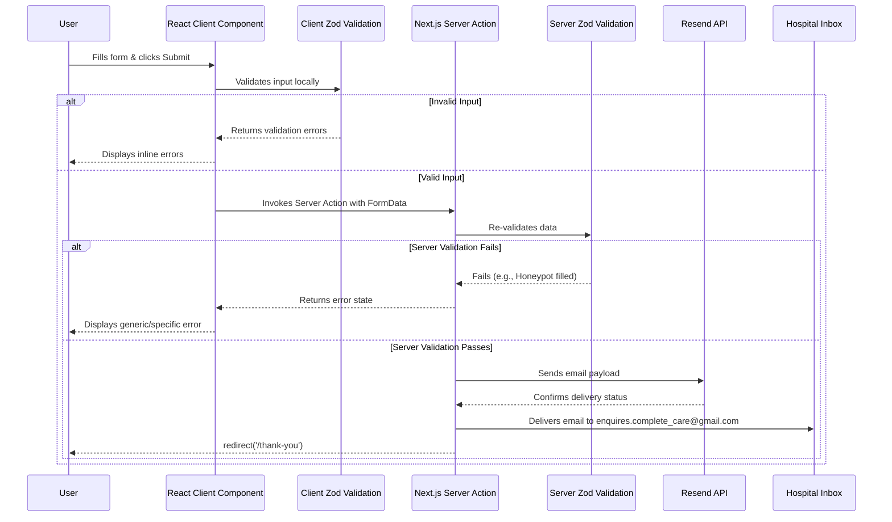

# Document 07: Data and Form Flow Specification
**Client:** Complete Care Hospital
**Version:** v2.0
**Status:** Approved — Ready for Build

## 1. Purpose and Scope
This document outlines the architecture, validation rules, and data flow for all user-facing forms on the Complete Care Hospital website. The project utilizes a modern React architecture with Next.js 15 (App Router). Forms are implemented as React components utilizing Next.js Server Actions for secure, server-side processing, Zod for robust validation, and Resend for email delivery. This ensures a seamless user experience while maintaining strict compliance with the Nigeria Data Protection Act (NDPA) 2023.

## 2. Form Handler Decision Matrix
The following options were evaluated for form processing in the new Next.js architecture:

### Option A: Next.js Server Actions + Resend (Recommended)
- **Mechanism:** Forms submit data directly to a Next.js Server Action. The server validates the data and triggers an email using the Resend API.
- **Pros:** 
  - Complete control over the data flow within the application stack.
  - No reliance on third-party form aggregator services.
  - Seamless integration with Zod for shared client/server validation schemas.
  - High performance and excellent developer experience.
  - Resend offers a generous free tier (100 emails/day) suitable for current volume.
  - Data never stored in a database — just validated and emailed.
- **Cons:** Requires a dedicated email API provider (Resend).

### Option B: Formspree (Fallback)
- **Mechanism:** React forms submit directly to Formspree endpoints. Still viable if the client prefers zero server-side code.
- **Pros:** Very simple setup; handles email dispatch internally; familiar to the client from previous iterations; works well with standard React form submission.
- **Cons:** Less cohesive architecture; introduces a dependency on a third-party form handler; customization is sometimes limited compared to custom server logic.

## 3. Recommended Decision
**Option A (Next.js Server Actions + Resend)** is the approved path. It aligns perfectly with the Next.js App Router architecture, providing enhanced security (data processed server-side, never exposed to client-side vulnerabilities), better performance, and a cohesive developer experience. Data is validated, emailed securely to the hospital, and discarded—it is *never* stored in a persistent database, minimizing NDPA compliance overhead.

## 4. Appointment Form Specification
The Appointment Form is the primary conversion point. It will be implemented using reusable React components (e.g., `FormField`).

### React Component Structure
```tsx
<form action={submitAppointmentAction}>
  <FormField name="fullName" label="Full Name" required />
  <FormField name="phone" label="Phone Number" type="tel" required />
  <FormField name="email" label="Email Address" type="email" />
  <FormField name="service" label="Department/Service" type="select" options={servicesList} />
  <FormField name="preferredDate" label="Preferred Date" type="date" />
  <FormField name="message" label="Additional Notes" type="textarea" />
  {/* Honeypot field */}
  <input type="text" name="_honey" style={{ display: 'none' }} tabIndex={-1} autoComplete="off" />
  <SubmitButton text="Request Appointment" />
</form>
```

### Zod Validation Schema
```typescript
import { z } from 'zod';

export const appointmentSchema = z.object({
  fullName: z.string().min(2, 'Full name is required'),
  phone: z.string().regex(/^(?:\+234|0)[789]\d{9}$/, 'Please enter a valid Nigerian phone number'),
  email: z.string().email('Invalid email address').optional().or(z.literal('')),
  service: z.string().min(1, 'Please select a service'),
  preferredDate: z.string().optional(),
  message: z.string().max(500, 'Message must be under 500 characters').optional(),
  _honey: z.string().max(0, 'Spam detected').optional() // Honeypot
});
```

## 5. Contact Form Specification
The Contact Form is used for general inquiries and is located on the Contact page.

### React Component Structure
```tsx
<form action={submitContactAction}>
  <FormField name="fullName" label="Full Name" required />
  <FormField name="email" label="Email Address" type="email" required />
  <FormField name="subject" label="Subject" required />
  <FormField name="message" label="Message" type="textarea" required />
  {/* Honeypot field */}
  <input type="text" name="_honey" style={{ display: 'none' }} tabIndex={-1} autoComplete="off" />
  <SubmitButton text="Send Message" />
</form>
```

### Zod Validation Schema
```typescript
import { z } from 'zod';

export const contactSchema = z.object({
  fullName: z.string().min(2, 'Full name is required'),
  email: z.string().email('A valid email address is required'),
  subject: z.string().min(3, 'Subject is required'),
  message: z.string().min(10, 'Message must be at least 10 characters').max(1000, 'Message is too long'),
  _honey: z.string().max(0, 'Spam detected').optional() // Honeypot
});
```

## 6. Validation Strategy
The architecture employs double validation to ensure data integrity and immediate user feedback.

1.  **Client-Side Validation:** Utilizes React Hook Form (or native React state) integrated with the Zod schemas via `@hookform/resolvers/zod`. This provides instant, inline error messages to the user without a round-trip to the server.
2.  **Server-Side Validation:** The Server Action (`submitAppointmentAction` / `submitContactAction`) re-validates the incoming `FormData` against the exact same Zod schema using `schema.safeParse()`. This guarantees that even if client-side scripts are bypassed, invalid data is rejected.

### Server Action Signature
```typescript
'use server'

import { appointmentSchema } from '@/lib/validations';
import { sendEmail } from '@/lib/email';
import { redirect } from 'next/navigation';

export async function submitAppointmentAction(prevState: any, formData: FormData) {
  // 1. Extract data
  // 2. Validate with appointmentSchema.safeParse(data)
  // 3. Return errors if validation fails
  // 4. Send email via Resend
  // 5. redirect('/thank-you') on success
}
```

## 7. Submission Flow Diagram


## 8. Email Templates (Internal Notification)
When a form is submitted successfully, the system dispatches a clean, formatted email to the hospital.

**To:** enquires.complete_care@gmail.com
**From:** noreply@completecarehospital.com.ng (or verified sending domain)

**Appointment Request Template:**
```text
Subject: NEW APPOINTMENT REQUEST - [Full Name]

A new appointment request has been submitted via the website.

DETAILS:
- Patient Name: [Full Name]
- Phone Number: [Phone]
- Email: [Email or 'Not provided']
- Requested Service: [Service]
- Preferred Date: [Date or 'Not provided']

ADDITIONAL NOTES:
[Message or 'None provided']

-----------------------------------------
This is an automated message from the Complete Care Hospital website.
```

**Contact Form Template:**
```text
Subject: WEBSITE INQUIRY - [Subject]

A new message has been submitted via the website contact form.

DETAILS:
- Sender Name: [Full Name]
- Sender Email: [Email]
- Subject: [Subject]

MESSAGE:
[Message]

-----------------------------------------
This is an automated message from the Complete Care Hospital website.
```

## 9. Auto-Responder Template (Patient Facing)
If the user provides an email address, an automatic acknowledgment is sent to them.

**To:** [User Email]
**Subject:** We've received your request - Complete Care Hospital

**Message:**
```text
Dear [Full Name],

Thank you for reaching out to Complete Care Hospital. We have received your [appointment request / message]. 

Our team is reviewing your submission and will contact you shortly, typically within 24 hours. If your matter is urgent, please call us directly at +234 806 539 5623.

Best regards,
The Complete Care Hospital Team
Phase 1, Opposite ABC Bakery, Police Barack Gate, Gwagwalada, Abuja
```

## 10. Success Redirect
Upon successful processing by the Server Action, the user is seamlessly redirected using the Next.js `redirect()` function to the `/thank-you` route.

```typescript
import { redirect } from 'next/navigation';
// ... inside server action upon success ...
redirect('/thank-you');
```
The Thank You page confirms receipt of the message and provides the emergency contact number (+234 806 539 5623) and quick links back to the Home or Services pages.

## 11. Spam Prevention Strategy
- **Honeypot Field:** A hidden input field (`_honey`) is included in the React component. Bots auto-filling forms will likely fill this hidden field. If the Server Action detects any value in `_honey` (via Zod `max(0)` rule), the submission is silently rejected (appearing successful to the bot, but not sending an email).
- **Rate Limiting:** Next.js Middleware (`middleware.ts`) will implement basic IP-based rate limiting on the form submission routes/actions to prevent abuse and spam bursts.

## 12. Data Handling and Compliance (NDPA 2023)
- **Zero Persistence:** Patient data submitted through these forms is *never* saved to a database. It exists only in memory on the Vercel edge/server during processing by the Server Action and is immediately dispatched via the Resend API.
- **Secure Transit:** All form submissions occur over HTTPS. The payload between the Next.js server and Resend is encrypted.
- **Data Minimization:** Only necessary information is collected. Sensitive health records (PHI) are explicitly discouraged from being entered into these general contact forms.

## 13. Error States and Handling
- **Client Validation Errors:** Handled by React state (e.g., via React Hook Form) and displayed inline with red text below the offending field. The form cannot submit until these are resolved.
- **Server Errors (e.g., Resend API failure):** The Server Action returns a structured error object. The React component catches this and displays a polite fallback message: "We're sorry, there was a problem sending your request. Please try calling us at +234 806 539 5623."
- **Critical Failures:** Handled by Next.js `error.tsx` (React Error Boundaries) to ensure the application does not crash completely, preserving the user experience even during unexpected server issues.
